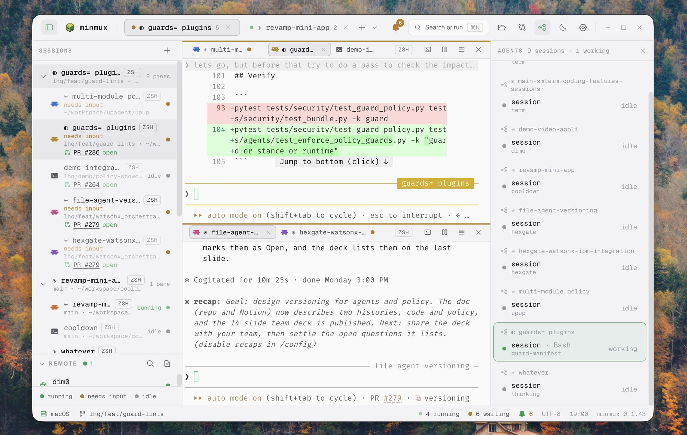
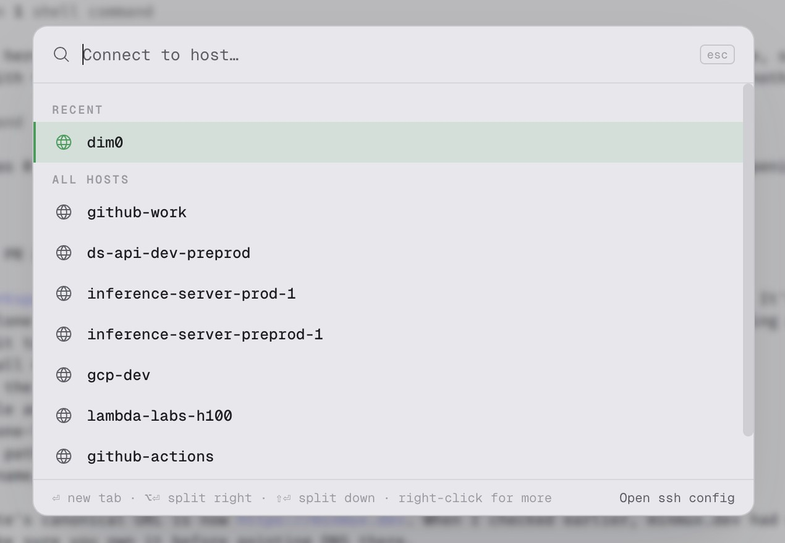
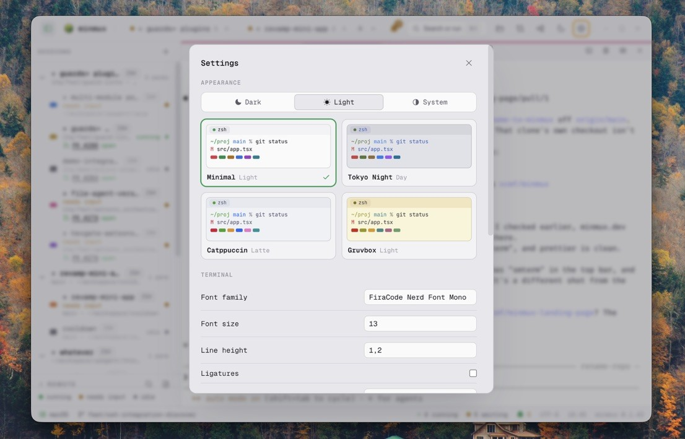

<p align="center">
  
</p>

<h1 align="center">minmux</h1>

<p align="center">A minimal terminal for agentic coding, built to keep you in the loop (yes we love reading the code).</p>

<p align="center"><sub>Works with <b>Claude Code</b>, <b>Codex</b> and <b>OpenCode</b>.</sub></p>

<p align="center">
  <a href="https://github.com/vcmf/minmux/releases/latest"></a>
  <a href="https://github.com/vcmf/minmux/actions/workflows/ci.yml"></a>
  <a href="LICENSE"></a>
  
</p>

<p align="center">If minmux looks useful to you, a ⭐ helps other people find it.</p>

<p align="center">
  
</p>

**minmux** is a terminal (tabs, split panes, your real shells) for people who run coding agents
all day. Run `claude`, `codex` or `opencode` in a pane as you always do, and minmux shows what
each one is doing: which session needs you, what its sub-agents are up to, which files changed,
and the diff.

## Why minmux

- **Your agents run unmodified.** minmux listens through each agent's own hooks or plugin
  system. There is no wrapper CLI to learn and no proxy between you and the model.
- **It leaves your setup alone.** minmux only wires the panes it opens, without editing your
  `~/.claude`, `~/.codex` or OpenCode config, and an agent started anywhere else is untouched.
  (Approving minmux's hooks in Codex is recorded by Codex in its own config.)
- **Quit and come back.** Quit minmux with an agent running, reopen it, and that session comes
  back in the same pane, in the same folder.
- **It's your own shell.** Your rc files, your `ssh`, your keys. Splits keep the shell and the
  folder, and your layout comes back after a restart.
- **No telemetry, no account.** The one request minmux makes is a check for a newer release on
  GitHub. (PR badges in the sidebar come from your own `gh`.)
- **It stays fast.** The terminal renders on WebGL and uses no CPU when idle. Agent tracking
  runs off the path your keystrokes and output take ([measurements](docs/PERF.md)).

## Install

macOS and Linux:

```
curl -fsSL https://raw.githubusercontent.com/vcmf/minmux/main/install.sh | sh
```

Windows (PowerShell):

```
irm https://raw.githubusercontent.com/vcmf/minmux/main/install.ps1 | iex
```

The script downloads the latest release from GitHub and puts it in `/Applications` on macOS
(`~/Applications` if that isn't writable), in `~/.local/bin/minmux` on Linux, and runs the
installer on Windows. Read [install.sh](install.sh) or [install.ps1](install.ps1) first if you
like. The agents themselves are not included: install `claude`, `codex` or `opencode` as usual.

## A closer look

<table>
  <tr>
    <td width="42%"></td>
    <td><b>Agents board.</b> A live tree of the Claude Code, Codex and OpenCode agents you launched: each session, its sub-agents, what they are doing, and token usage. Click one to jump to its pane.</td>
  </tr>
  <tr>
    <td width="42%"></td>
    <td><b>Notifications when a session needs you.</b> A dot on the tab and a native OS notification the moment a background pane wants input or finishes.</td>
  </tr>
  <tr>
    <td width="42%"></td>
    <td><b>Every session and pane at a glance.</b> The sidebar tree shows each session, its panes, and a status dot: running, needs input, or idle.</td>
  </tr>
  <tr>
    <td width="42%"></td>
    <td><b>SSH sessions.</b> Your <code>~/.ssh/config</code> hosts in one picker, recent first. Enter opens a tab, ⌥Enter splits right, ⇧Enter splits down. It runs your own <code>ssh</code>, so keys, agents and 2FA prompts work as usual, and splits stay on the host. <a href="docs/SSH.md">More on SSH.</a></td>
  </tr>
  <tr>
    <td width="42%"></td>
    <td><b>Changes panel.</b> A live git diff for the focused pane's working directory, with per-file counts and the full unified diff.</td>
  </tr>
  <tr>
    <td width="42%"></td>
    <td><b>Files browser.</b> A lazy per-folder listing rooted at the pane's cwd, with git decorations on changed files.</td>
  </tr>
  <tr>
    <td width="42%"></td>
    <td><b>Open a file and read it.</b> Click a file to open an inline preview and read what an agent wrote, without leaving the terminal.</td>
  </tr>
  <tr>
    <td width="42%"></td>
    <td><b>Themes and settings.</b> Minimal, Tokyo Night, Catppuccin and Gruvbox, each in dark and light, or following the system. Fonts, size and line height sit right below, all backed by one <code>settings.json</code>.</td>
  </tr>
</table>

## Agents

|                 | Board and sub-agents | Tokens | Name and colour                   | Resume after restart                 | Setup            |
| --------------- | -------------------- | ------ | --------------------------------- | ------------------------------------ | ---------------- |
| **Claude Code** | yes                  | yes    | `/rename`, `/color`               | yes                                  | none             |
| **Codex**       | yes                  | yes    | its name; colour after `/rename`  | yes, confirmed at your first message | approve `/hooks` |
| **OpenCode**    | yes, nested          | yes    | its title; colour after `/rename` | yes                                  | none             |

- A pane's colour is your choice: Claude's `/color`, or a name you gave the session. Names an
  agent picks for itself are shown in plain text.
- **Codex** asks you to approve minmux's hooks once, and again when a minmux update changes
  them. When it does, a strip in the pane says how: type `/hooks` in Codex and press `t`.
- Claude Code and Codex are wired in zsh and bash panes; OpenCode in any shell.
- **OpenCode** gets a small minmux plugin in the panes minmux opens, next to your own plugins.
- Each integration can be switched off in Settings. Codex and OpenCode are not wired on Windows
  or in WSL panes yet.

## Is minmux for you?

It is if you run agents in a terminal and want to see what they are doing without leaving it,
and you still read and edit the code yourself.

It probably isn't if you want an IDE, a chat interface, or a tool that plans and runs the
agents for you. In minmux you drive the agents; it shows you what they did.

## Why I built this

I love the terminal, and the easiest way to put an agent like Claude Code to work is to launch
it from a CLI. But I also like reading the code an agent writes and making the edits myself, and
a plain terminal makes that hard: you lose track of which session needs you, and you never
really see what changed. minmux keeps the shell I already like and adds just enough to stay in
the loop: the Changes, Files, and Agents panels show what happened, not just that something
did. It also behaves the same on macOS, Linux and WSL, which helps since my work moves between
all three.

## More

- **SSH.** The hosts in your `~/.ssh/config` are one click away; splits stay on the host, and a
  dropped connection reconnects. [Everything about SSH](docs/SSH.md).
- **Settings.** One `settings.json`, editable by hand or in the app, applied as you save.
  [Configuration](docs/CONFIGURATION.md).
- **Keyboard.** A command palette (⌘K) for sessions, splits, themes and settings; find in
  scrollback with `Cmd`/`Ctrl+Shift` + `F`.

## What is still rough

This is v0. I use it every day, and it will still surprise you sometimes.

- On macOS it is Apple Silicon only for now. Intel is not built yet.
- The app is not code-signed or notarized, so installing it outside the script gives you a
  security prompt the first time.
- A pane's status (working, needs input, idle) comes partly from a heuristic (is the pane still
  producing output?), so it reads wrong once in a while.
- The Agents board knows Claude Code, Codex and OpenCode. Another agent needs its own adapter.
- Windows and WSL have had far less real-world use than macOS and Linux, so expect rougher edges
  there.
- After a full quit, your layout and your agents' sessions come back, but other running
  processes (a dev server, a build) do not.

Found a bug? [Open an issue](https://github.com/vcmf/minmux/issues). What you did, what
happened, and what you expected is all it takes for a useful report.

## Build from source

```
git clone https://github.com/vcmf/minmux
cd minmux
make install   # deps, native module rebuild, git hooks
make run       # dev mode
make dist      # package an installable build for your OS
```

`make run` uses its own **dev profile** (`~/.config/minmux-dev`, `%APPDATA%\minmux-dev` on
Windows; a DEV badge by the logo), so it runs next to an installed minmux without touching its
settings or layout.
`MINMUX_PROFILE=<name> make run` picks another profile (one per worktree, say);
`MINMUX_PROFILE=default` uses the installed app's config, only while that app is closed. An
installed minmux ignores `MINMUX_PROFILE`; start it with `--profile=<name>` instead (macOS:
`open -a minmux --args --profile=qa`).

Run `make help` for the full list of targets (`make check` runs lint + tests, `make fmt`
formats). Logic lives in small pure modules with real tests (`make test`).

Stack, if you care: Electron, React, TypeScript, xterm.js on the WebGL renderer, and node-pty
for the shells. Zustand for state, react-resizable-panels for the layout, Vitest for tests.
Design and decisions live in [`docs/`](docs/): start with
[ARCHITECTURE.md](docs/ARCHITECTURE.md) and [ROADMAP.md](docs/ROADMAP.md).

## Uninstall

- macOS: delete `minmux.app` from `/Applications` (or `~/Applications`).
- Linux: delete `~/.local/bin/minmux` (and `~/.local/bin/smterm`, if the installer left that
  link from the app's old name).
- Windows: Settings > Apps > Installed apps > minmux.

For a clean slate, also delete your settings and layout in `~/.config/minmux`
(`%APPDATA%\minmux` on Windows) and, on macOS, the app's data in
`~/Library/Application Support/minmux`.

## License

[MIT](LICENSE). Do what you want with it.
